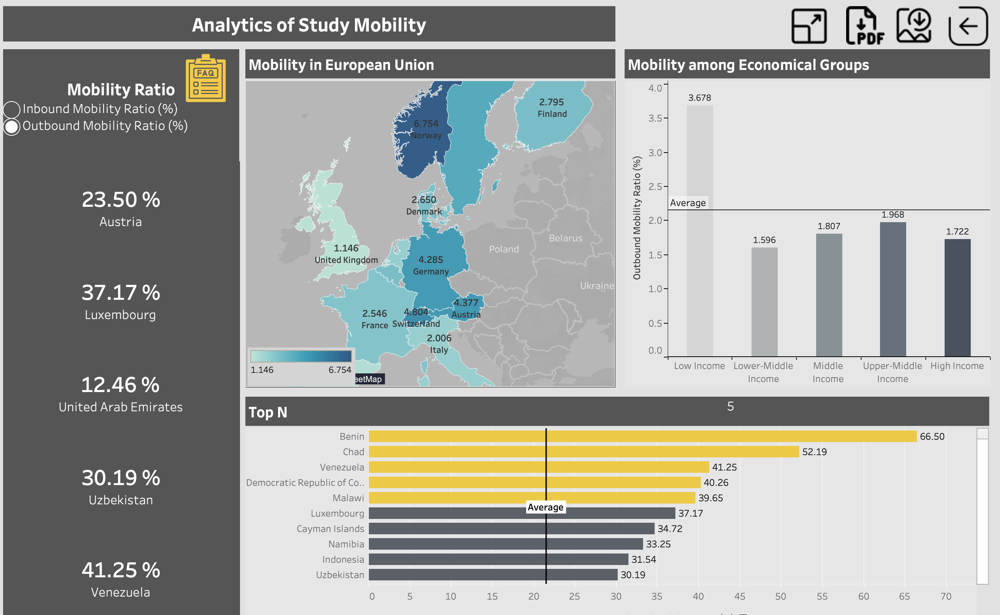

# Pandas assisted Feature Engineering on Study Mobility: Tableau Dashboards for Students' Preferences

This dataset aims to facilitate an understanding of global student mobility trends over time, allowing viewers to identify patterns and gain valuable insights into educational preferences across different nations. 

It examines two ratios : Inbound Mobility Ratio(%) and Outbounnd Mobility Ratio(%).

Inbound Mobility Ratio(%): the number of foreign students studying in a specific country, expressed as a percentage of the total tertiary enrollment in the country. It emphasizes how attractive certain countries are for international students seeking education opportunities.

Outbound Mobility Ratio(%): the number of domestic students studying abroad from particular country relative to its total tertiary enrolment. This ratio highlights on how many students want to pursue education outside their home countries.

## Tools

Python's Pandas Library

Tableau Desktop

## View Interactive Charts and Dashboards 

https://public.tableau.com/app/profile/sevilay.munire.girgin/vizzes

For sneak peak see Images section. 
## Establishes

Worldwide Average Mobility
1- Inbound Mobility Ratio(%) remains stable over 16-year time span. 
2- Outbound Mobility Ratio(%) peaked sharply in 2008, followed by a sudden decline.

Average Mobility among Continents
1- Europe and Central Asia have 2-folds of average mobility among analyzed countries. 
2- African and Middle East inbound mobility is average (of analyzed groups). 
3- Latin America and the Caribbean host the least number of students from abroad.
4- Sub-Saharan sends the highest number of students to study abroad. 
5- Latin America and the Caribbean also have the least outbound mobility.

Mobility in America
1- Over 14 years, North America received significantly more international students than South America.
2- Conversely, South America sends more students abroad over 14 years than North America.

Mobility among Socioeconomical Unions
1- The European Union is the most attractive place for students to study abroad.
2- Unlike the EU, Least Developed and Heavily Indebted Countries have the least inbound mobility (compared to other unions).
3- Least Developed and Heavily Indebted Countries send more students abroad to study than the average (of analyzed groups). 
4- OECD Members have the least average outbound mobility (of analyzed groups). 

Average mobility in Europe Continent:
1- Austria and Switzerland are the most attractive countries for students who study outside their country.
2- Compared to other countries, Norway has a higher average outbound mobility ratio.

Average mobility among economic groups:
1- The analysis indicates that high-income countries have 4-fold income mobility compared to lower-middle-income countries.
2- Even for upper-middle-income countries, average. Inbound mobility remains very low compared to high-income countries.
3- Low-income countries send most students to study abroad.
4- Nonetheless, outgoing mobility has a similar trajectory among middle, upper-middle-income, and high-income countries.

## Dashboard Images 

## Acknowledgements
- Original data source:
https://ourworldindata.org/tertiary-education

 - Dataset by  Dennis Kao
 https://data.world/professorkao

 - readme.so

 

